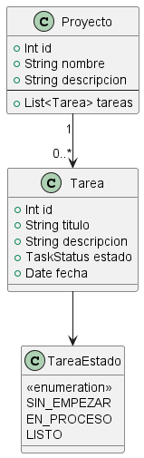

# Sistema de Gestión de Proyectos y Tareas
Aplicación fullstack para gestionar proyectos y sus tareas.

Permite crear, editar, ver y eliminar proyectos y tareas, así como visualizar las tareas de cada proyecto.

- Backend con SpringBoot
- Frontend con Angular
- Base de datos MySQL
- API REST

## Estructura
Backend en `backend/proyecto` , corre en el puerto 8080.
- Para la configuración de puertos, usuarios de MySQL, etc. el archivo `application.properties` se encuentra dentro de `src/main/resources/application.properties`
- El backend ya incluye el frontend en el JAR.

Frontend en `frontend` , corre en el puerto 4200.
- `/proyectos` muestra la tabla de proyectos, con opción para navegar a las tareas al dar clic en las celdas de la columna.
- `/tareas` muestra la tabla de tareas, con opción para navegar a sus proyectos al dar clic en las celdas de la columna.

## Modelo de datos
